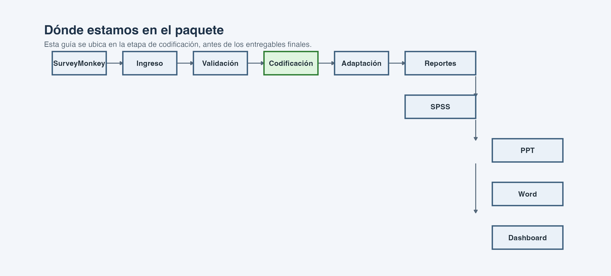
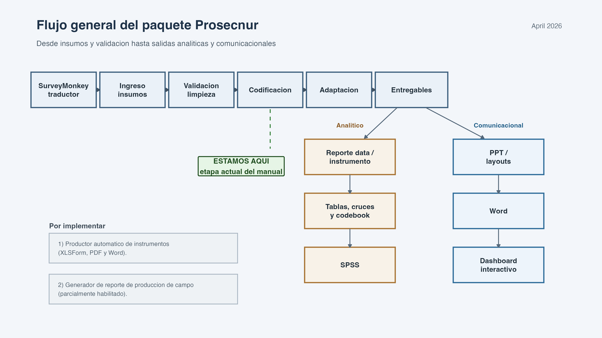
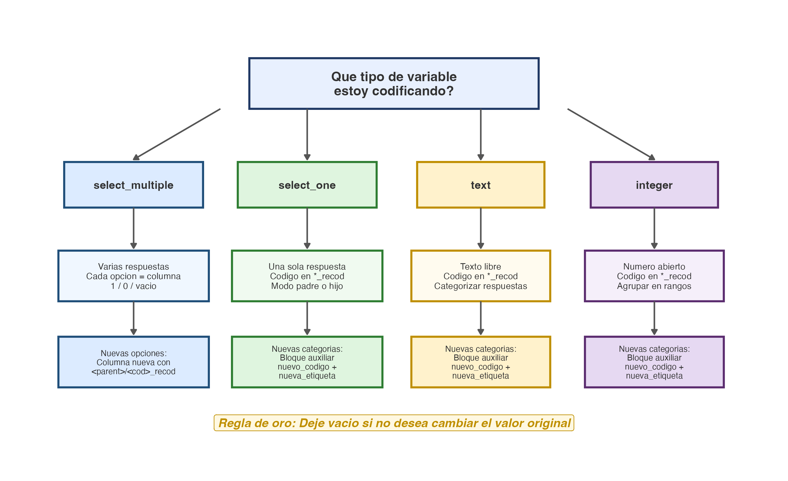
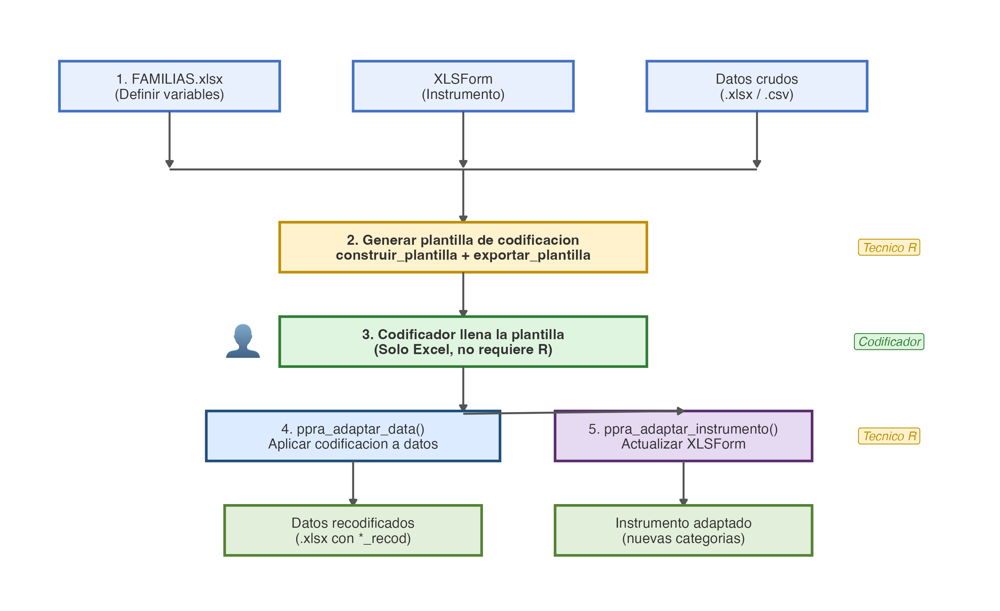

{width=3cm}

```{r}
#| include: false
current_input_path <- tryCatch(knitr::current_input(), error = function(e) "")
manual_dir <- if (is.character(current_input_path) && length(current_input_path) == 1 && nzchar(current_input_path)) {
  normalizePath(dirname(current_input_path), winslash = "/")
} else {
  normalizePath(getwd(), winslash = "/")
}
knitr::opts_knit$set(root.dir = manual_dir)
manual_file <- function(...) file.path(manual_dir, "files_manuales", ...)
manual_input <- function(...) file.path(manual_dir, "insumos", ...)
manual_qmd <- if (is.character(current_input_path) && length(current_input_path) == 1 && nzchar(current_input_path)) basename(current_input_path) else "guia_codificacion_aplicada.qmd"

if (!requireNamespace("prosecnur", quietly = TRUE)) {
  stop("Instale o cargue `prosecnur` antes de renderizar esta guía.", call. = FALSE)
}

library(prosecnur)
```

```{r}
#| include: false
ej_dir <- manual_input()

inst_demo <- leer_instrumento_xlsform(file.path(ej_dir, "GIZ_INST.xlsx"))
dat_demo  <- leer_datos(file.path(ej_dir, "GIZ_DATA_LIMPIA.xlsx"))

fams_demo <- leer_familias_clasificar(
  path = file.path(ej_dir, "GIZ_familiasv2.xlsx"),
  inst = inst_demo,
  dat  = dat_demo
)

plantilla_demo <- construir_plantilla_desde_familias(
  inst  = inst_demo,
  dat   = dat_demo,
  split = fams_demo
)

path_tpl_demo <- tempfile("plantilla_codif_", fileext = ".xlsx")
exportar_plantilla_codificacion_xlsx(
  plantilla = plantilla_demo,
  path_xlsx = path_tpl_demo,
  inst      = inst_demo
)

sm_vars_demo <- fams_demo$select_multiple %>%
  dplyr::filter(use) %>%
  dplyr::pull(parent) %>%
  unique()

so_parent_vars_demo <- fams_demo$select_one %>%
  dplyr::filter(use, modo_so == "padre") %>%
  dplyr::pull(parent) %>%
  unique()

so_child_vars_demo <- fams_demo$select_one %>%
  dplyr::filter(use, modo_so == "hijo") %>%
  dplyr::pull(parent) %>%
  unique()

int_vars_demo <- character(0)

path_data_demo <- tempfile("datos_adaptados_", fileext = ".xlsx")
ppra_adaptar_data(
  path_instrumento = file.path(ej_dir, "GIZ_INST.xlsx"),
  path_datos = file.path(ej_dir, "GIZ_DATA_LIMPIA.xlsx"),
  path_plantilla = path_tpl_demo,
  sm_vars = sm_vars_demo,
  so_parent_vars = so_parent_vars_demo,
  so_child_vars = so_child_vars_demo,
  int_vars = int_vars_demo,
  out_path = path_data_demo,
  path_familias = file.path(ej_dir, "GIZ_familiasv2.xlsx")
)

path_inst_demo <- tempfile("instrumento_adaptado_", fileext = ".xlsx")
ppra_adaptar_instrumento(
  path_instrumento_in = file.path(ej_dir, "GIZ_INST.xlsx"),
  path_data_adaptada = path_data_demo,
  path_instrumento_out = path_inst_demo,
  sm_vars = sm_vars_demo,
  so_parent_vars = so_parent_vars_demo,
  so_child_vars = so_child_vars_demo,
  integer_vars = int_vars_demo,
  path_plantilla = path_tpl_demo
)
```

# Por qué existe este flujo de codificación

Cuando un equipo levanta datos en campo con herramientas como KoboToolbox u ODK,
la información que llega a la base rara vez está lista para análisis directo. Los
cuestionarios diseñados en formato XLSForm producen variables de distintos tipos
--- preguntas de selección única (`select_one`), selección múltiple
(`select_multiple`), textos abiertos y valores numéricos enteros --- y cada tipo
plantea desafíos específicos al momento de tabular resultados.

Considere un ejemplo concreto. Usted administra una encuesta con una pregunta
`select_one` sobre el motivo de visita a un establecimiento de salud. Entre las
opciones aparece "Otro (especifique)". Cuando el respondente elige esa opción y
escribe "vacunación de mi hijo", usted necesita decidir si esa respuesta se
incorpora a una categoría existente, se crea una categoría nueva o se mantiene
como texto. Esa decisión no puede automatizarse: requiere juicio humano. Lo que
sí puede automatizarse es todo lo que viene después --- trasladar esa decisión a
la base de datos y al instrumento de forma consistente y sin errores manuales.

Eso es exactamente lo que resuelve este flujo de codificación. Su propósito es
separar el trabajo analítico (las decisiones de recodificación) del trabajo
mecánico (aplicar esas decisiones a la base y al instrumento). Las decisiones se
toman en un archivo Excel editable --- la plantilla de codificación --- y el
paquete se encarga de ejecutar cada una de ellas sobre los datos originales.

El resultado son dos productos sincronizados:

- una **base adaptada**, donde las variables ya reflejan las decisiones de
  codificación (nuevas categorías, agrupaciones numéricas, textos reclasificados);
- un **instrumento adaptado**, donde las listas de opciones y los tipos de
  variable coinciden exactamente con lo que existe en la base.

Esa sincronización es fundamental. Si adapta los datos pero no el instrumento,
las funciones de reporte posteriores (`reporte_frecuencias()`,
`reporte_codebook()`, entre otras) producirán etiquetas que no corresponden a
los valores reales de la base. La codificación en `prosecnur` garantiza que ambos
productos avancen juntos.

## A quién va dirigida esta guía

Esta guía está pensada para analistas que procesan datos de encuestas y necesitan
un flujo reproducible de codificación. No requiere experiencia avanzada en R:
los bloques de código que encontrará más adelante son llamadas a funciones con
parámetros bien definidos, no scripts complejos. Lo que sí conviene es tener
claridad sobre la estructura de su estudio --- qué preguntas existen, qué
opciones de respuesta tienen y qué decisiones de recodificación se necesitan.

Si es la primera vez que trabaja con `prosecnur`, lea esta guía de principio a
fin antes de ejecutar el código. Si ya conoce el flujo y solo necesita recordar
un paso, la sección "Ruta corta recomendada" al final del documento le servirá
como referencia rápida.

# Archivo fuente QMD

Este PDF sale del archivo:

`r manual_qmd`

La lógica de esta serie es simple: el PDF funciona como guía de lectura y el
`.qmd` funciona como versión completamente resuelta. Si quiere ver el flujo con
todo el código desarrollado y comentarios línea por línea, abra ese `.qmd`
dentro de `inst/manuales_qmd/`.

El archivo `.qmd` es además un documento vivo: puede copiarlo a la carpeta de su
proyecto, ajustar las rutas a sus propios datos e instrumento, y ejecutarlo paso
a paso. Todos los bloques de código corren de principio a fin sobre los datos de
ejemplo incluidos, lo que significa que si algo falla al renderizar, el problema
está en las rutas o en la instalación del paquete, no en la lógica del flujo.

# Dónde estamos en el paquete

Esta guía se ubica en la familia de **codificación** del paquete. Es la etapa
en la que `prosecnur` transforma decisiones analíticas en cambios consistentes
sobre datos e instrumento, antes de pasar a la etapa de reportes y salidas
visuales.

Los diagramas de esta guía se construyen a partir de los scripts del paquete,
especialmente desde `scripts/generar_diagramas_manuales_qmd.R`, y luego se
publican dentro de `files_manuales/img/` para que el QMD y el PDF usen la misma
versión visual.

{width=100%}

La lectura práctica es esta:

- primero el paquete entiende qué hay en el instrumento y en los datos;
- después usted decide qué familias realmente entran a codificación;
- luego el paquete le entrega una plantilla editable;
- finalmente esa plantilla se aplica tanto a la base como al instrumento.

# Flujo visual de esta guía

{width=100%}

Para ponerlo en términos concretos: imagine que levantó una encuesta de salud con
80 preguntas. De esas 80, quizás 6 son preguntas de selección única con opción
"otro especifique", 2 son de selección múltiple, 3 son campos de texto abierto y
4 son variables numéricas (como edad o número de visitas) que necesita agrupar en
rangos. El resto de las variables ya tiene categorías fijas y no requiere
intervención. Este flujo le permite concentrarse exactamente en esas 15 variables
que sí necesitan trabajo, sin tocar las demás.

Note también que el flujo alterna entre pasos automáticos y pasos que requieren
decisión humana. Los pasos 1, 3, 4 y 5 son esencialmente automáticos: el paquete
lee, construye, aplica y exporta. El paso 2 (decidir familias) y la edición de
la plantilla entre los pasos 3 y 4 son los momentos en que su equipo toma
decisiones metodológicas. Esa separación es intencional: permite que las
decisiones analíticas queden documentadas en un archivo Excel auditable, mientras
que la ejecución técnica queda en manos del código.

# Qué necesita antes de empezar

Este ejemplo usa archivos pequeños incluidos dentro de `files_manuales`.

```{r}
list.files(manual_input())
```

Resumen rápido de cada archivo:

| Archivo | Para qué sirve | Cuándo lo usa |
|---|---|---|
| `instrumento_ejercicio.xlsx` | Instrumento original | Al inicio y al final |
| `datos_ejercicio.xlsx` | Base original | Al inicio y al adaptar |
| `familias_ejercicio_resuelta.xlsx` | Decisión de familias | Antes de construir la plantilla |
| `plantilla_codificacion_*.xlsx` | Plantilla editable | Durante la recodificación |

{width=100%}

## Qué hay dentro de cada archivo

Antes de ejecutar cualquier código, conviene entender qué contiene cada archivo
de ejemplo. Esto le ayudará a reconocer la estructura cuando trabaje con sus
propios datos.

**`instrumento_ejercicio.xlsx`** es un archivo XLSForm, el estándar que usan
KoboToolbox y ODK para definir cuestionarios. Contiene al menos dos hojas:

- `survey`: una fila por cada pregunta del cuestionario, con columnas como
  `type` (el tipo de pregunta: `select_one`, `select_multiple`, `text`,
  `integer`), `name` (el nombre técnico de la variable) y una o más columnas
  de etiqueta (`label::Spanish (es)`, por ejemplo);
- `choices`: una fila por cada opción de respuesta, agrupadas por `list_name`.
  Cada opción tiene un código (`name`) y una etiqueta legible.

Si nunca ha trabajado con XLSForm, piense en la hoja `survey` como el índice de
preguntas y en `choices` como el catálogo de respuestas posibles.

**`datos_ejercicio.xlsx`** es la exportación directa de las respuestas
recolectadas. Cada fila es un respondente y cada columna es una variable.
Además de las variables del cuestionario, suele incluir columnas de metadatos
como `_uuid` (identificador único del registro) y `_submission_time` (fecha de
envío). Los nombres de columna pueden incluir prefijos o guiones bajos
automáticos del sistema de recolección.

**`familias_ejercicio_resuelta.xlsx`** es el archivo de decisión donde alguien
ya marcó qué grupos de variables entran al proceso de codificación y cómo deben
tratarse. Es el producto del paso 2 de este flujo. En la práctica, su equipo
recibirá primero una versión en blanco (generada por
`escribir_plantilla_familias()`) y la devolverá completada después de tomar las
decisiones pertinentes.

## Lista de verificación antes de comenzar

Antes de ejecutar el primer bloque de código, confirme estos puntos:

- el paquete `prosecnur` está instalado y puede cargarse con `library(prosecnur)`;
- tiene acceso al instrumento XLSForm correspondiente a su estudio, no a una
  versión anterior o de prueba;
- tiene la exportación de datos completa (no una muestra parcial, a menos que
  eso sea intencional);
- si ya cuenta con una hoja de familias resuelta, confirme que fue llenada
  sobre la versión correcta del instrumento.

# Cómo leer esta guía

Cada paso responde cuatro preguntas muy concretas:

1. qué problema resuelve;
2. qué función corre;
3. qué archivo produce;
4. qué debe revisar antes de seguir.

La meta no es aprender la lógica interna del paquete sino poder ejecutar el
flujo con seguridad.

# Vista general de entradas y salidas

| Momento | Entrada principal | Salida principal | Funciones ancla |
|---|---|---|---|
| Lectura | XLSForm y base | Objetos `inst` y `dat` | `leer_instrumento_xlsform()`, `leer_datos()` |
| Familias | `inst` y `dat` | Hoja de familias | `escribir_plantilla_familias()`, `leer_familias_clasificar()` |
| Plantilla | Familias resueltas | Excel editable | `construir_plantilla_desde_familias()`, `exportar_plantilla_codificacion_xlsx()` |
| Adaptación de data | Plantilla resuelta | Base adaptada | `ppra_adaptar_data()` |
| Adaptación de instrumento | Base adaptada y plantilla | Instrumento adaptado | `ppra_adaptar_instrumento()` |

# Paso 1. Leer el instrumento y la base

## Qué resuelve este paso

Este paso le da contexto al paquete. Sin él, el sistema todavía no sabe qué
preguntas existen, cómo se llaman ni qué forma tienen los datos.

En términos prácticos, aquí suceden dos cosas. Primero,
`leer_instrumento_xlsform()` lee el archivo XLSForm y construye un objeto
estructurado que el paquete usará a lo largo de todo el flujo. No solo lee las
hojas `survey` y `choices` tal cual están, sino que las enriquece: detecta
automáticamente la columna de etiquetas en español (buscando patrones como
`label::Spanish (es)` o `label::es`), normaliza los nombres de las listas de
opciones, identifica el tipo base de cada pregunta y asigna un orden secuencial.

Segundo, `leer_datos()` lee la base exportada y produce un objeto que incluye
tanto los datos originales como una versión con nombres de columna limpiados
(usando `janitor::make_clean_names()`), además de un mapa de correspondencia
entre nombres originales y nombres limpios. Esa correspondencia es útil cuando
los nombres originales tienen caracteres especiales o espacios que dificultan
el trabajo en R.

## Código base

```{r}
#| eval: false
library(prosecnur)

# Leer el instrumento original.
inst <- leer_instrumento_xlsform(
  "insumos/instrumento_ejercicio.xlsx"
)

# Leer la base original.
dat <- leer_datos(
  "insumos/datos_ejercicio.xlsx",
  sheet = "main"
)
```

## Qué esperar

- un objeto `inst` con la estructura del XLSForm;
- un objeto `dat` con la base lista para inspección;
- una primera confirmación de que el instrumento y la base dialogan entre sí.

El objeto `inst` es una lista con cuatro elementos: `survey_raw` y `choices_raw`
(las hojas originales sin modificar) y `survey` y `choices` (las versiones
enriquecidas con columnas calculadas como `type_base`, `list_norm`,
`label_spanish_es` y `q_order`). Si necesita consultar cómo se llama una
variable o qué opciones tiene, puede explorar `inst$survey` e `inst$choices`
directamente.

El objeto `dat` es una lista con tres elementos: `raw` (los datos tal cual se
leyeron), `clean` (con nombres de columna normalizados) y `name_map` (una tabla
con dos columnas --- `clean` y `original` --- que permite reconstruir el nombre
original de cualquier variable).

## Cómo verificar que todo está bien

Una forma rápida de confirmar que los objetos se crearon correctamente:

- revise `nrow(inst$survey)` para confirmar que el número de filas coincide con
  la cantidad de preguntas que espera en su cuestionario;
- revise `ncol(dat$raw)` para confirmar que la cantidad de columnas coincide con
  lo que ve al abrir el Excel manualmente;
- si trabaja con un XLSForm multilenguaje, confirme que
  `inst$survey$label_spanish_es` no sea todo `NA` --- si lo es, la detección
  automática de la columna en español no encontró un patrón reconocido y deberá
  revisar los nombres de columna en su archivo.

## Qué revisar antes de avanzar

- que la hoja de datos correcta se haya leído (el parámetro `sheet` en
  `leer_datos()` debe coincidir con la hoja que contiene los datos principales);
- que las variables clave del estudio sí existan en `dat$raw`;
- que no esté apuntando por error a una versión antigua del instrumento.

## Errores comunes en este paso

El error más frecuente es indicar un nombre de hoja incorrecto en `leer_datos()`.
Si su exportación de KoboToolbox tiene varias hojas (una principal y una o más de
grupos repetidos), asegúrese de leer primero la hoja principal. Otro error
habitual es usar un instrumento que no corresponde a la versión de la base: si
agregó o eliminó preguntas entre versiones, el instrumento y los datos estarán
desalineados y los pasos siguientes fallarán.

# Paso 2. Decidir qué familias entran a codificación

## Qué resuelve este paso

No todo lo que está en una base necesita recodificación. La hoja de familias
sirve para marcar qué entra, qué se excluye y cómo debe tratarse cada caso.

La hoja de familias es el primer gran punto de decisión del flujo. Ahí se
define qué entra, qué queda fuera y cómo se interpretará cada familia antes de
construir la plantilla.

## Qué es una familia y por qué importa

El concepto de "familia" es central en este flujo y conviene entenderlo antes de
avanzar. Una familia es una agrupación lógica de columnas en la base de datos,
organizada alrededor de una variable principal (el "padre"). El paquete no
trabaja con variables sueltas sino con familias porque, en la práctica, una sola
pregunta del cuestionario puede generar múltiples columnas en los datos.

Veamos los tres casos principales:

**Familia de `select_one` con "otro especifique".** Suponga que tiene la
pregunta "¿Cuál es el motivo principal de su visita?" con opciones como
consulta médica, vacunación, control prenatal y "otro (especifique)". En su base,
esta pregunta genera al menos dos columnas: la columna principal (por ejemplo
`motivo`) con el código de la opción seleccionada, y una columna de texto
(`motivo_other` o similar) donde el respondente escribió su especificación cuando
eligió "otro". La familia agrupa ambas columnas bajo el padre `motivo`. Al
codificar, su equipo revisará los textos de "otro" y decidirá si crear nuevas
categorías o reasignar a categorías existentes.

**Familia de `select_multiple`.** Suponga la pregunta "¿Qué servicios utilizó?"
con opciones como consulta, laboratorio, farmacia, emergencias y "otro". En la
base, esta pregunta genera una columna principal (`servicios`) con las opciones
concatenadas, más una columna binaria (0/1) por cada opción --- `servicios_1`,
`servicios_2`, etc. --- y potencialmente una columna de texto para "otro" y una
columna binaria que indica si "otro" fue seleccionado. La familia agrupa todo
eso: la variable padre, sus columnas dummy, la columna de texto y la columna
del dummy de "otro".

**Familia de `integer`.** Variables numéricas como edad o número de visitas no
tienen columnas asociadas, pero el flujo permite agruparlas en rangos (por
ejemplo, convertir edad en grupos etarios). La familia en este caso es
simplemente la variable padre.

**Familia de `text`.** Variables de texto libre que no están asociadas a ningún
`select_one` ni `select_multiple`. Estas familias solo entran al flujo si el
texto no fue "adoptado" por otra familia como su `text_col`.

Piense en las familias como carpetas: cada carpeta agrupa una pregunta padre con
todas sus columnas relacionadas. La hoja de familias es el inventario de esas
carpetas, donde usted marca cuáles abrir y cómo trabajar con cada una.

## Si todavía no existe una hoja de familias

```{r}
#| eval: false
escribir_plantilla_familias(
  # Instrumento ya leído.
  inst = inst,

  # Base ya leída.
  dat = dat,

  # Archivo Excel que servirá como punto de partida.
  path = "familias_ejercicio.xlsx",

  # Incluye variables de texto para que puedan evaluarse dentro del flujo.
  incluir_text_vars = TRUE
)
```

Esta función genera un archivo Excel con dos hojas. La hoja principal,
`familias`, contiene una fila por cada familia detectada en el instrumento. La
segunda hoja, `ayuda`, incluye instrucciones de uso. El Excel viene formateado
con colores por tipo de variable para facilitar la lectura: verde para
`select_multiple`, azul para `select_one`, morado para `integer` y amarillo para
`text`.

La hoja de familias recién generada es un punto de partida: algunas columnas
vendrán prellenadas con las mejores suposiciones del paquete, pero otras
requerirán que su equipo tome decisiones. Las columnas que terminan en `_cands`
(candidatos) son sugerencias automáticas --- por ejemplo, `text_col_cands` le
muestra las columnas de texto que podrían estar asociadas a esa familia. Su
trabajo es verificar esas sugerencias y, si corresponde, copiar el valor correcto
a la columna definitiva (`text_col`).

## Si la hoja ya fue revisada por el equipo

```{r}
#| eval: false
fams <- leer_familias_clasificar(
  # Archivo ya revisado o resuelto.
  path = "insumos/familias_ejercicio_resuelta.xlsx",

  # Objetos base del flujo.
  inst = inst,
  dat = dat
)
```

Lo que esta función devuelve no es un simple data frame sino una lista
estructurada con varios elementos. Los más importantes son:

- `$select_multiple`, `$select_one`, `$integer` y `$text`: subconjuntos de las
  familias aceptadas, ya filtradas por tipo;
- `$choices_usadas`: un catálogo de todas las opciones de respuesta que
  efectivamente se usarán en el flujo, con su código y etiqueta en español;
- `$adopciones`: una tabla que muestra qué columnas de texto fueron "adoptadas"
  como hijas de una familia `select_one` o `select_multiple`. Si una columna de
  texto fue asignada como `text_col` de otra familia, ya no aparecerá como
  familia independiente de tipo `text`;
- `$textos_huerfanos`: columnas de texto que no fueron adoptadas por ninguna
  familia. Si esperaba que un texto estuviera vinculado a una pregunta y aparece
  aquí, revise la columna `text_col` en la hoja de familias;
- `$resumen`: un resumen numérico con el total de filas, cuántas fueron
  aceptadas por tipo y cuántas fueron excluidas.

La función también imprime un resumen en consola (a menos que indique
`verbose = FALSE`). Ese resumen es un buen primer control: si muestra cero
familias aceptadas para un tipo que usted esperaba ver, el problema
probablemente está en la hoja de familias.

## Qué mirar dentro de la hoja de familias

| Columna | Qué le dice en lenguaje simple |
|---|---|
| `use` | Si esa familia entra o no entra al flujo |
| `modo_so` | Cómo tratar una pregunta `select_one` |
| `text_col` | Qué texto abierto acompaña la codificación |
| `other_dummy_col` | Dónde está la opción equivalente a “otro” |

En la práctica, aquí conviene leer la hoja como una pauta de decisión: primero
si la familia entra, luego cómo se comporta, y finalmente qué campos la apoyan.

## Guía práctica para llenar cada columna

**`use`**: controla si la familia entra o no al flujo. Acepte valores como
`TRUE`, `1`, `si`, `sí` o `yes` para incluir, y `FALSE`, `0`, `no` para
excluir. Una buena estrategia es comenzar con todo en `TRUE` y luego desactivar
las familias que no necesitan codificación.

**`modo_so`**: solo aplica para familias de tipo `select_one`. Tiene dos
opciones:

- `”padre”`: el texto abierto de “otro especifique” se usa para recodificar la
  variable original. Es decir, los textos se convierten en nuevas categorías que
  se agregan a la lista existente de opciones. Use este modo cuando quiere
  enriquecer las opciones de respuesta de la pregunta original.
- `”hijo”`: el texto se codifica como una variable nueva e independiente, con su
  propia lista de opciones. Use este modo cuando el texto responde una pregunta
  conceptualmente distinta a la pregunta padre (por ejemplo, un campo de
  “especifique el tipo de tratamiento” que merece ser analizado por separado).

Si una familia `select_one` tiene `modo_so` vacío, la función de clasificación
emitirá un error de validación. Toda familia `select_one` debe tener un modo
definido.

**`text_col`**: es la columna de texto asociada a la familia. Para
`select_one`, suele ser la columna de “otro especifique”. Para
`select_multiple`, es la columna de texto que acompaña la opción “otro”. Las
columnas `text_col_cands` le sugieren opciones detectadas automáticamente;
verifique cuál es la correcta y cópiela a `text_col`.

**`other_dummy_col`**: solo relevante para `select_multiple`. Es la columna
binaria (0/1) que indica si el respondente seleccionó “otro”. Sin esta columna,
el paquete no puede identificar qué registros necesitan revisión de texto. Las
columnas `other_dummy_cands` le sugieren opciones.

Las reglas de aceptación del paquete son:

- `select_multiple`: necesita `use = TRUE`, que `text_col` exista en la base y
  que `other_dummy_col` exista en la base;
- `select_one`: necesita `use = TRUE` y que `text_col` exista en la base;
- `integer`: necesita `use = TRUE` y que `parent_col` exista en la base;
- `text`: necesita `use = TRUE` y que la columna no haya sido adoptada por otra
  familia como su `text_col`.

Si una familia cumple con `use = TRUE` pero no con las demás condiciones, será
excluida. Puede consultar el motivo exacto en el elemento `$diagnostico_clasificacion`
del resultado de `leer_familias_clasificar()`.

## Señal para pasar al siguiente paso

Puede seguir cuando ya tiene claro qué familias serán trabajadas y la hoja no
necesita más decisiones conceptuales.

# Paso 3. Convertir familias en una plantilla editable

## Qué resuelve este paso

La hoja de familias todavía no es el archivo que el equipo edita para recodificar.
Este paso toma esas decisiones y las convierte en una plantilla de trabajo.

La diferencia es importante: la hoja de familias dice *qué* variables entran al
flujo; la plantilla de codificación dice *cómo* recodificar cada valor concreto.
Es el paso en que las decisiones conceptuales se materializan en un archivo
donde su equipo puede trabajar celda por celda.

{width=100%}

## Código base

```{r}
#| eval: false
plantilla <- construir_plantilla_desde_familias(
  # Instrumento del estudio.
  inst = inst,

  # Base del estudio.
  dat = dat,

  # Familias ya clasificadas.
  split = fams
)

exportar_plantilla_codificacion_xlsx(
  # Objeto interno que arma el paquete.
  plantilla = plantilla,

  # Ruta del Excel final que se editará fuera de R.
  path_xlsx = "plantilla_codificacion_ejercicio.xlsx",

  # Instrumento que ayuda a completar labels y metadatos.
  inst = inst
)
```

## Qué esperar

- una hoja de instrucciones;
- una o más hojas editables por familia o tipo de codificación;
- columnas auxiliares para nuevas categorías o recodificaciones.

Piense la plantilla como el punto en que la decisión metodológica se convierte
en archivo editable. Por eso conviene tocar solo las columnas pensadas para esa
edición.

## Qué contiene la plantilla por dentro

El Excel exportado tiene una estructura definida que conviene conocer antes de
abrirlo:

- una **hoja de navegación** que lista todas las familias incluidas con su nombre,
  tipo y la hoja correspondiente dentro del libro. Es el índice del archivo;
- un **diccionario** con los metadatos de cada variable (nombre, etiqueta, tipo,
  lista de opciones asociada);
- un **catálogo de opciones** (`choices`) con todos los códigos y etiquetas
  originales de las listas de respuesta;
- **una hoja por familia** donde aparecen los valores reales de la base que
  necesitan revisión. Para familias de `select_multiple`, la hoja muestra cada
  texto de “otro” con columnas para asignar un nuevo código. Para familias de
  `select_one`, muestra las opciones originales con una columna para el valor
  recodificado. Para familias de `integer`, muestra los valores numéricos con
  columnas para definir rangos.

## Cómo editar la plantilla

Dentro de cada hoja de familia encontrará columnas de referencia (que muestran
los valores originales, las etiquetas y los contextos) y columnas editables
(típicamente las que incluyen `_recod` en su nombre). La regla fundamental es:
**edite solo las columnas destinadas a edición**.

Evite renombrar columnas, agregar o eliminar hojas, o modificar la estructura
del archivo. La función `ppra_adaptar_data()` del siguiente paso espera encontrar
la plantilla exactamente como fue generada, salvo por los valores que usted
introduzca en las columnas editables. Si la estructura cambia, la adaptación
fallará.

Si dos personas necesitan trabajar en la plantilla simultáneamente, una opción
es que cada una trabaje en familias distintas (hojas distintas). No editen la
misma hoja al mismo tiempo, ya que Excel no maneja bien los conflictos de
edición concurrente.

## Regla práctica

Este es el archivo que su equipo debe intervenir. Si alguien pregunta “¿dónde
hacemos la codificación?”, la respuesta normal es: en la plantilla exportada.

# Paso 4. Aplicar la plantilla a los datos

## Qué resuelve este paso

Después de la edición humana, el paquete toma esas decisiones y las lleva a la
base final. La función `ppra_adaptar_data()` lee la plantilla editada, interpreta
cada decisión de recodificación y la aplica a los datos originales. El resultado
es una base nueva con columnas adicionales que reflejan las recodificaciones,
sin modificar las columnas originales.

Es importante entender qué hace cada grupo de parámetros, ya que indican al
paquete cómo interpretar las distintas familias:

- **`sm_vars`**: un vector con los nombres de las variables `select_multiple` que
  participan en la codificación. La función necesita saber cuáles son para
  manejar correctamente las columnas dummy (una por opción) y reconstruir la
  variable recodificada a partir de ellas.

- **`so_parent_vars`**: las variables `select_one` que se tratan en modo "padre".
  Sus textos de "otro" se convierten en nuevos códigos que se agregan a la lista
  original de opciones.

- **`so_child_vars`**: las variables `select_one` en modo "hijo". Sus textos se
  codifican como variables nuevas e independientes, con su propia lista de
  opciones.

- **`int_vars`**: las variables numéricas enteras que se categorizarán en rangos.
  Por ejemplo, la edad podría convertirse en grupos etarios definidos en la
  plantilla.

- **`path_familias`**: la ruta al archivo de familias. Se relee para asegurar que
  la lógica de adaptación sea consistente con la clasificación original.

```{r}
#| eval: false
ppra_adaptar_data(
  # Instrumento original del estudio.
  path_instrumento = "insumos/instrumento_ejercicio.xlsx",

  # Datos originales.
  path_datos = "insumos/datos_ejercicio.xlsx",

  # Plantilla ya editada o resuelta.
  path_plantilla = "plantilla_codificacion_ejercicio_resuelta.xlsx",

  # Variables select_multiple involucradas.
  sm_vars = c("servicios"),

  # Variables select_one tratadas como padre.
  so_parent_vars = c("motivo"),

  # Variables select_one tratadas como hijo.
  so_child_vars = c("satisfaccion"),

  # Variables numéricas enteras que también participan.
  int_vars = c("edad"),

  # Ruta de salida de la base ya adaptada.
  out_path = "datos_adaptados_ejercicio.xlsx",

  # Hoja de familias que acompaña la lectura del flujo.
  path_familias = "insumos/familias_ejercicio_resuelta.xlsx"
)
```

## Qué esperar

- una base nueva;
- variables recodificadas o reorganizadas según la plantilla;
- un archivo que ya puede alimentar salidas posteriores.

Concretamente, la base adaptada tendrá las mismas filas que la base original
pero con columnas adicionales. Para cada variable recodificada, encontrará una
nueva columna con sufijo `_recod` (el código nuevo) y en algunos casos una
columna `_recod_label` (la etiqueta legible del código nuevo). Estas columnas
se insertan inmediatamente a la derecha de la columna original, lo que facilita
la comparación visual al abrir el Excel.

## Qué revisar antes de seguir

- que el archivo de salida efectivamente se haya creado;
- que las variables clave tengan la estructura esperada;
- que el equipo no haya modificado columnas técnicas de la plantilla.

Para una verificación más concreta, abra el archivo de salida y:

- confirme que el número de filas es el mismo que en la base original (la
  adaptación no debe agregar ni eliminar registros);
- busque las columnas `_recod` y verifique que existen para cada familia que
  incluyó en el flujo;
- revise algunos registros al azar: si un respondente eligió "otro" y el texto
  fue recodificado como "vacunación", la columna `_recod` debería mostrar el
  código correspondiente a esa nueva categoría.

# Paso 5. Aplicar la misma lógica al instrumento

## Por qué este paso importa

La codificación no termina en la base. Si el instrumento no se adapta, después
puede quedar una distancia incómoda entre lo que dice el cuestionario y lo que
ya existe en la base adaptada.

Suponga que en el paso anterior recodificó la variable `motivo` y ahora la base
tiene un código nuevo (por ejemplo `7`) para "vacunación", que antes no existía
en la lista de opciones original. Si el instrumento sigue teniendo solo los
códigos 1 a 6, funciones como `reporte_codebook()` o `reporte_frecuencias()` no
tendrán etiqueta para ese código 7. El resultado serán tablas con valores
numéricos sin nombre, lo cual invalida el reporte.

`ppra_adaptar_instrumento()` resuelve exactamente esto. Modifica las hojas
`survey` y `choices` del instrumento para reflejar la realidad de la base
adaptada: agrega nuevas opciones de respuesta a las listas existentes, crea
nuevas entradas en `survey` para las variables `_recod` y ajusta los tipos de
variable cuando es necesario. El parámetro `choices_order` permite controlar el
orden de las opciones en las listas adaptadas: `"original_first"` coloca primero
las opciones que ya existían, `"by_first_seen"` las ordena según su primera
aparición en los datos y `"alphabetical"` las ordena alfabéticamente.

```{r}
#| eval: false
ppra_adaptar_instrumento(
  # Instrumento original.
  path_instrumento_in = "insumos/instrumento_ejercicio.xlsx",

  # Base ya transformada en el paso anterior.
  path_data_adaptada = "datos_adaptados_ejercicio.xlsx",

  # Ruta de salida del instrumento coherente con la codificación final.
  path_instrumento_out = "instrumento_adaptado_ejercicio.xlsx",

  # Variables select_multiple del flujo.
  sm_vars = c("servicios"),

  # Variables select_one tipo padre.
  so_parent_vars = c("motivo"),

  # Variables select_one tipo hijo.
  so_child_vars = c("satisfaccion"),

  # Variables enteras involucradas.
  integer_vars = c("edad"),

  # Plantilla final usada como referencia.
  path_plantilla = "plantilla_codificacion_ejercicio_resuelta.xlsx"
)
```

## Resultado esperado

Al final del recorrido tendrá dos salidas sincronizadas:

- una base adaptada;
- un instrumento adaptado.

Estos dos archivos forman un par inseparable. Piense en ellos como un contrato:
la base dice qué valores existen y el instrumento dice qué significa cada valor.
Si vuelve a ejecutar la adaptación de datos (porque la plantilla fue
actualizada, por ejemplo), debe también volver a ejecutar la adaptación de
instrumento. Nunca use una base adaptada con un instrumento que no fue adaptado
en el mismo ciclo.

Eso deja listo el terreno para pasar a entregables como codebook, SPSS o tablas.

# Ruta corta recomendada

Si necesita memorizar una sola secuencia, quédese con esta:

1. `leer_instrumento_xlsform()`
2. `leer_datos()`
3. `escribir_plantilla_familias()` solo si aún no existe hoja base
4. `leer_familias_clasificar()`
5. `construir_plantilla_desde_familias()`
6. `exportar_plantilla_codificacion_xlsx()`
7. edición humana de la plantilla
8. `ppra_adaptar_data()`
9. `ppra_adaptar_instrumento()`

En la práctica, los pasos 1 a 6 se ejecutan una sola vez al inicio del estudio.
El paso 7 (la edición humana de la plantilla) es el que consume más tiempo
calendario, porque depende de que el equipo revise cada texto y tome decisiones
de recodificación. Los pasos 8 y 9 son rápidos y pueden repetirse tantas veces
como sea necesario si la plantilla se actualiza.

Una buena práctica es guardar los archivos intermedios (hoja de familias,
plantilla exportada, base adaptada, instrumento adaptado) con un identificador
de versión o fecha, especialmente si el proceso de codificación se extiende a lo
largo de varias semanas. Eso le permite rastrear qué versión de la plantilla
produjo qué versión de la base.

# Problemas frecuentes y dónde mirar

| Si pasa esto | Lo primero que conviene revisar |
|---|---|
| Una familia no entra al flujo | La columna `use` |
| Un `select_one` no se adapta bien | La columna `modo_so` |
| Falta el texto que acompaña a “otro” | `text_col` y `other_dummy_col` |
| La plantilla abre, pero la adaptación falla | Si la plantilla fue editada fuera de las columnas pensadas para edición |
| Nombres de columna con caracteres extraños | La correspondencia entre `dat$raw` y `dat$clean` |
| Variables duplicadas en la base | Nombres de columna repetidos en la exportación original |
| Etiquetas en español no se detectan | Nombres de columna en la hoja `survey` del XLSForm |

A continuación, un poco más de detalle sobre los problemas más comunes:

**Una familia no entra al flujo.** Lo primero es confirmar que `use` esté en
`TRUE` (o `1`, `si`, `sí`). Si lo está, revise las condiciones de aceptación
por tipo. Para `select_multiple`, el paquete requiere que tanto `text_col` como
`other_dummy_col` existan como columnas reales en la base. Si alguna de las dos
no existe (por ejemplo, porque el nombre tiene un error tipográfico), la familia
será excluida silenciosamente. Consulte `$diagnostico_clasificacion` en el
resultado de `leer_familias_clasificar()` para ver el motivo exacto.

**Un `select_one` no se adapta bien.** Verifique que `modo_so` sea exactamente
`”padre”` o `”hijo”` (en minúsculas, sin espacios). Si el modo es “padre” pero
los textos de “otro” no están generando nuevos códigos, revise que la columna
`text_col` apunte a la columna correcta de texto en la base y que la plantilla
de codificación tenga valores en las columnas de recodificación.

**La plantilla abre pero la adaptación falla.** El error más habitual es que
alguien editó la plantilla fuera de las columnas previstas: renombró una hoja,
borró una columna de referencia o agregó filas. La función espera encontrar la
estructura original intacta. Si necesita regenerar la plantilla, ejecute
nuevamente `construir_plantilla_desde_familias()` y
`exportar_plantilla_codificacion_xlsx()`, y luego traslade manualmente las
decisiones de recodificación desde la plantilla editada a la nueva.

# Cierre

La codificación se deja pensar mejor como un flujo visual que como una lista de
funciones sueltas:

- primero decide el terreno de trabajo en la hoja de familias;
- después convierte esa decisión en una plantilla editable;
- finalmente aplica esa plantilla tanto a los datos como al instrumento.

El valor de este flujo no está solo en la automatización sino en la trazabilidad.
Cada decisión de recodificación queda registrada en la plantilla de Excel, lo
que significa que otro miembro del equipo puede revisar, cuestionar o actualizar
esas decisiones sin necesidad de leer código. Y si los datos cambian (porque se
agregaron registros, por ejemplo), basta con volver a ejecutar los pasos 8 y 9
con la misma plantilla para obtener una base actualizada y consistente.

Cuando esa parte ya quedó resuelta, el siguiente paso natural es pasar a la
guía de entregables. Ahí encontrará cómo convertir la base adaptada y el
instrumento adaptado en productos concretos: un codebook que documenta cada
variable, un archivo SPSS listo para compartir, tablas de frecuencias, cruces
por variables de comparación y reportes de seguimiento por encuestador. Las
funciones de entrada a ese flujo son `reporte_instrumento()` y
`reporte_data()`, que toman como insumo exactamente los archivos que acaba de
producir aquí.

```{r}
#| results: asis
#| echo: false
source(manual_file("scripts", "diccionario_argumentos.R"))

manual_render_argument_dictionary(
  qmd_path = knitr::current_input(),
  package = "prosecnur",
  prioridad = c(
    "leer_instrumento_xlsform",
    "leer_datos",
    "escribir_plantilla_familias",
    "leer_familias_clasificar",
    "construir_plantilla_desde_familias",
    "exportar_plantilla_codificacion_xlsx",
    "ppra_adaptar_data",
    "ppra_adaptar_instrumento",
    "reporte_instrumento",
    "reporte_data",
    "reporte_codebook",
    "reporte_frecuencias"
  )
)
```
