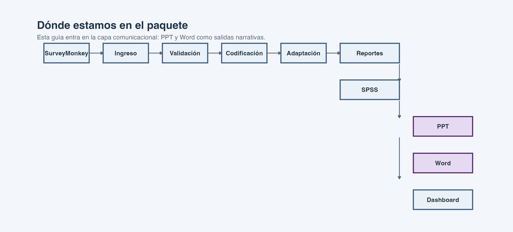
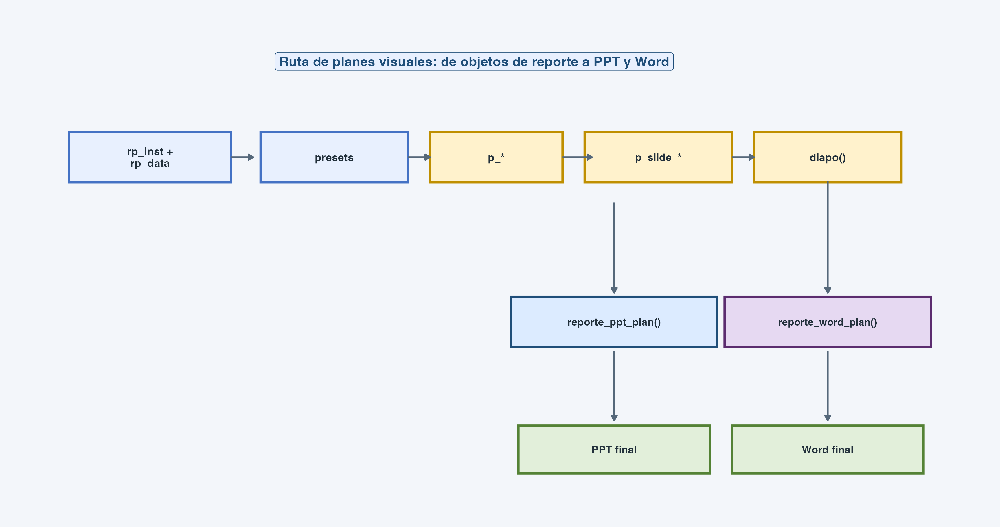
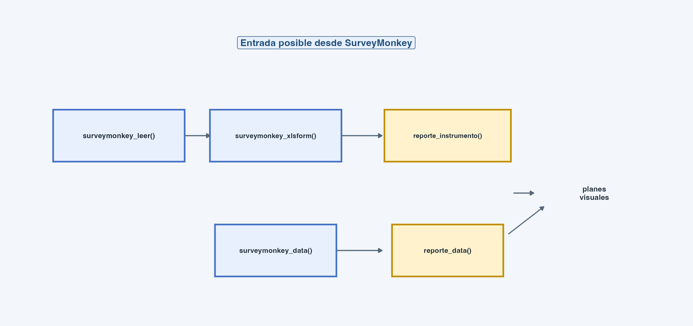
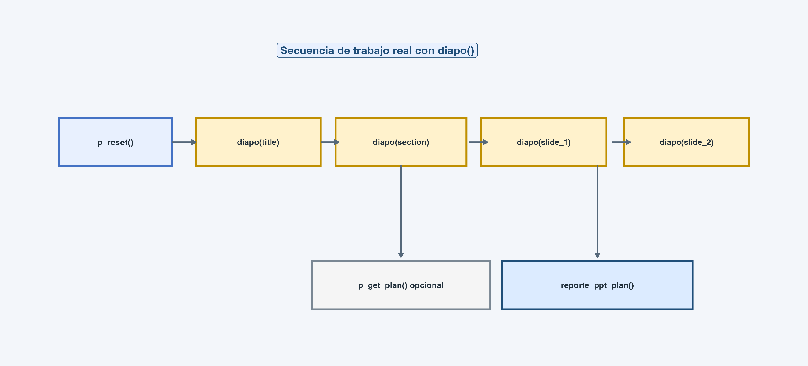

{width=3cm}

```{r}
#| include: false
current_input_path <- tryCatch(knitr::current_input(), error = function(e) "")
manual_dir <- if (is.character(current_input_path) && length(current_input_path) == 1 && nzchar(current_input_path)) {
  normalizePath(dirname(current_input_path), winslash = "/")
} else {
  normalizePath(getwd(), winslash = "/")
}
knitr::opts_knit$set(root.dir = manual_dir)
manual_file <- function(...) file.path(manual_dir, "files_manuales", ...)
manual_input <- function(...) file.path(manual_dir, "insumos", ...)
manual_qmd <- if (is.character(current_input_path) && length(current_input_path) == 1 && nzchar(current_input_path)) basename(current_input_path) else "guia_ppt_plan_aplicada.qmd"

if (!requireNamespace("prosecnur", quietly = TRUE)) {
  stop("Instale o cargue `prosecnur` antes de renderizar esta guía.", call. = FALSE)
}

library(prosecnur)
```

```{r}
#| include: false
rp_data_demo <- readRDS(manual_input("rp_data.rds"))
rp_inst_demo <- readRDS(manual_input("rp_inst.rds"))

presets_demo <- list(
  base = list(
    args = list(
      formato = "Base: %s",
      sufijo_auto = "Establecimientos de Salud",
      size_titulo = 12,
      size_subtitulo = 9,
      size_leyenda = 10,
      size_ejes = 10,
      color_titulo = "#39588B",
      color_subtitulo = "#39588B",
      color_leyenda = "#39588B",
      color_ejes = "#39588B",
      textos_negrita = c("titulo", "leyenda", "barra_extra", "eje_y", "valores")
    )
  ),
  barras_apiladas = list(
    args = list(
      usar_canvas = TRUE,
      canvas_w_etiquetas = 0.12,
      canvas_w_bars = 0.60,
      canvas_w_extra = 0.12,
      canvas_h_toprow_in = 0.10,
      canvas_h_header_in = 0.15,
      canvas_h_legend_in = 0.15,
      alto_por_categoria = 0.46,
      mostrar_barra_extra = TRUE,
      prefijo_barra_extra = "N = "
    )
  ),
  barras_agrupadas = list(
    args = list(
      usar_canvas = TRUE,
      canvas_w_etiquetas = 0.15,
      canvas_w_bars = 0.58,
      canvas_w_extra = 0.15,
      mostrar_leyenda = FALSE,
      invertir_barras = TRUE
    )
  ),
  pie = list(
    args = list(
      usar_canvas = TRUE,
      leyenda_posicion = "abajo",
      ncol_leyenda_bajo = 2
    )
  )
)

p_reset(verbose = FALSE)
diapo(
  p_slide_title(
    title = "Ejemplo de plan visual",
    subtitle = "Manual aplicado",
    date = format(Sys.Date(), "%d/%m/%Y")
  )
)
diapo(p_slide_section(title = "Frecuencias"))
diapo(
  p_slide_1(
    title = "Distribución de p102",
    plot = p_barras_apiladas("p102")
  )
)
diapo(
  p_slide_2(
    title = "Dos miradas rápidas",
    left = p_barras_apiladas("region"),
    right = p_pie("p112")
  )
)

plan_demo <- p_get_plan()

path_demo_ppt <- tempfile("manual_ppt_", fileext = ".pptx")
reporte_ppt_plan(
  data = rp_data_demo,
  instrumento = rp_inst_demo,
  path_ppt = path_demo_ppt,
  presets = presets_demo,
  plan = plan_demo,
  mensajes_progreso = FALSE,
  template_pptx = system.file("plantillas/plantilla_16_9.pptx", package = "prosecnur")
)
```

# De tablas a narrativa visual: por qué automatizar presentaciones

En el trabajo con encuestas, producir presentaciones en PowerPoint es una de las
tareas que más tiempo consume. El ciclo habitual es conocido: el analista genera
tablas en R o Excel, copia gráficos uno por uno a las diapositivas, ajusta
tamaños, colores y títulos, y repite el proceso cada vez que los datos se
actualizan o el cliente pide una versión revisada. Ese trabajo manual es lento,
inconsistente y difícil de reproducir.

El sistema de planes visuales de `prosecnur` resuelve este problema separando
las decisiones de contenido de la ejecución mecánica. Usted decide qué gráfico
va en qué diapositiva, con qué estilo y qué título. El paquete se encarga de
renderizar cada gráfico, colocarlo en el layout correcto, aplicar los presets
de estilo y escribir el archivo `.pptx` final.

Para entender cómo funciona, piense en una analogía musical. Los **presets** son
los instrumentos con su afinación --- definen colores, tamaños de texto,
proporciones del lienzo. Las **piezas `p_*`** son las notas individuales ---
cada una especifica un gráfico concreto (barras apiladas de tal variable, pie de
tal otra). Los **layouts `p_slide_*`** son los compases --- definen cómo se
organizan las notas en el espacio (una gráfica central, dos gráficas lado a
lado, texto con gráfica). Y **`diapo()`** es el director que acumula la partitura
diapositiva por diapositiva.

Lo más valioso de esta arquitectura es que el mismo plan visual puede producir
tanto un PowerPoint como un documento Word. Usted construye la narrativa una sola
vez y elige el formato de salida al final.

# Archivo fuente QMD

Este PDF sale del archivo:

`r manual_qmd`

El PDF está pensado como una guía visual. El `.qmd` que lo acompaña es la
versión resuelta completa, con más comentarios y código listo para adaptar a un
proyecto real.

Esta guía se enfoca en el flujo con `diapo()` (la forma en que el equipo trabaja
en la práctica) en lugar de la función `p_plan()` (que sigue disponible pero es
menos frecuente en los flujos reales).

# Dónde estamos en el paquete

Esta guía se ubica en la parte **comunicacional** del paquete. Es la capa donde
la base preparada entra a `reporte_ppt_plan()` y `reporte_word_plan()` para
producir PPT y Word como salidas narrativas finales.

Los diagramas de esta guía también salen de `scripts/` y se copian a
`files_manuales/img/` al publicar los manuales, para que la capa visual quede
alineada con la arquitectura real del paquete.

{width=100%}

# Un mapa más fiel a tu forma de trabajar

Este manual ya no presenta `p_plan()` como camino principal. Aquí nos quedamos
con la lógica que efectivamente usas en tus QMD de trabajo: `p_reset()` +
`diapo()` + `reporte_ppt_plan()`.

{width=100%}

La idea importante es esta: primero arma un plan visual una sola vez y luego
ese mismo plan puede servir para PPT y también para Word.

El diagrama muestra el flujo completo: `p_reset()` limpia cualquier plan
anterior, luego cada llamada a `diapo()` agrega una diapositiva a un acumulador
interno (un registro que va guardando cada slide en memoria), y finalmente
`reporte_ppt_plan()` lee ese acumulador y renderiza todo en un archivo
PowerPoint. Si después quiere el mismo contenido en Word, `reporte_word_plan()`
toma el mismo plan y lo traduce a bloques secuenciales de documento.

La diferencia con el enfoque `p_plan()` es sutil pero práctica: `p_plan()`
requiere construir una lista explícita con todas las diapositivas de una vez,
mientras que `diapo()` le permite ir construyendo la presentación
incrementalmente, como quien va apilando páginas. En un QMD de trabajo, donde
va intercalando código con comentarios y ajustes, `diapo()` resulta más natural.

# De dónde sale este flujo

Los patrones que verá en esta guía no son construcciones teóricas: provienen de
archivos de trabajo reales del equipo, validados en producción con datos y
presentaciones de estudios concretos.

Esta guía está pensada mirando especialmente dos referencias de trabajo reales:

- `prueba_plan_ppt.qmd`
- `ejecutar_surveymonkey_prosecnur.qmd`

Además, la parte Word conversa directamente con:

- `prueba_plan_word.qmd`

# Qué resuelve este sistema

Si lo piensa en lenguaje de trabajo, el sistema resuelve cuatro capas:

| Capa | Qué decide | Objetos principales |
|---|---|---|
| Preparación | Qué base y qué instrumento alimentan el reporte | `reporte_instrumento()`, `reporte_data()` |
| Estilo | Cómo se verán los gráficos | `presets`, `p_presets()` |
| Composición | Qué pieza entra en qué layout | `p_*`, `p_slide_*`, `diapo()` |
| Exportación | A qué formato final sale | `reporte_ppt_plan()`, `reporte_word_plan()` |

Estas cuatro capas funcionan de forma acumulativa:

La **preparación** usa los mismos objetos `reporte_instrumento()` y
`reporte_data()` de la guía de entregables. Esto significa que las etiquetas,
los órdenes de opciones y los metadatos de medición serán idénticos a los que
usó para generar frecuencias, cruces o SPSS. No necesita preparar los datos de
una forma distinta para las presentaciones.

El **estilo** se define en los presets: una estructura de lista que fija el ADN
visual de toda la presentación. Colores institucionales, tamaños de texto,
proporciones del lienzo, comportamiento de la leyenda. Una vez definidos, los
presets se aplican a todos los gráficos sin necesidad de repetir configuraciones
en cada diapositiva.

La **composición** es el paso creativo: usted elige qué dato contar en cada
diapositiva, con qué tipo de gráfico y en qué disposición espacial. Aquí es
donde la presentación toma forma narrativa.

La **exportación** es mecánica: el sistema traduce su composición a XML de
PowerPoint (vía el paquete `officer`) o a bloques de documento Word. Usted no
necesita interactuar con estos formatos directamente.

# El flujo completo, incluyendo SurveyMonkey

Como se ve en `ejecutar_surveymonkey_prosecnur.qmd`, a veces el proceso no
arranca con un XLSX listo sino con exportes SurveyMonkey.

{width=100%}

Esto ayuda a entender que el sistema de planes visuales no depende de un único
modo de entrada: puede trabajar tanto con estudios ya preparados (datos de
KoboToolbox, ODK o bases manuales) como con flujos integrados desde
SurveyMonkey. Las funciones `surveymonkey_leer()`, `surveymonkey_xlsform()` y
`surveymonkey_data()` traducen los datos de SurveyMonkey al formato que el
sistema espera, y a partir de ahí todo funciona igual.

# Antes de empezar

En esta guía se usa un ejemplo ya preparado dentro de `insumos/`.

```{r}
list.files(manual_input())
```

La base mínima es:

```{r}
#| eval: false
rp_data <- readRDS("insumos/rp_data.rds")
rp_inst <- readRDS("insumos/rp_inst.rds")
```

Si todavía no tiene esos objetos, primero pase por la guía de entregables hasta
`reporte_instrumento()` y `reporte_data()`.

Los archivos `.rds` son objetos de R guardados en disco. Usar `.rds` es una
buena práctica para flujos de presentación porque evita re-ejecutar la
preparación de datos cada vez que ajusta una diapositiva. Genere los objetos una
vez con `saveRDS(rp_data, "rp_data.rds")` y luego léalos con `readRDS()` al
inicio de su QMD de presentación.

# Capa 1. Presets como usted los trabaja en la práctica

En tus QMD de prueba, los presets no aparecen como una idea abstracta. Aparecen
como una lista larga y explícita donde define tamaños, canvas, leyendas, bases
y ajustes finos por tipo de gráfico. Esta guía va a respetar esa lógica.

En términos prácticos, `base$args` fija el tono general y luego cada bloque
especializado ajusta el comportamiento de un tipo concreto de gráfico.

## Un esquema base inspirado en tus pruebas

```{r}
#| eval: false
presets <- list(
  base = list(
    args = list(
      formato = "Base: %s",
      sufijo_auto = "Establecimientos de Salud",
      size_titulo = 12,
      size_subtitulo = 9,
      size_leyenda = 10,
      size_ejes = 10,
      size_nota_pie = 8,
      color_titulo = "#39588B",
      color_subtitulo = "#39588B",
      color_leyenda = "#39588B",
      color_ejes = "#39588B",
      color_nota_pie = "#39588B",
      textos_negrita = c("titulo", "leyenda", "barra_extra", "eje_y", "valores")
    )
  ),

  barras_apiladas = list(
    args = list(
      usar_canvas = TRUE,
      canvas_w_etiquetas = 0.12,
      canvas_w_buf_etq_bars = 0.02,
      canvas_w_bars = 0.60,
      canvas_w_buf_bars_extra = 0.02,
      canvas_w_extra = 0.12,
      canvas_h_toprow_in = 0.10,
      canvas_h_header_in = 0.15,
      canvas_h_legend_in = 0.15,
      alto_por_categoria = 0.46,
      mostrar_barra_extra = TRUE,
      prefijo_barra_extra = "N = "
    )
  ),

  barras_agrupadas = list(
    args = list(
      usar_canvas = TRUE,
      canvas_w_etiquetas = 0.15,
      canvas_w_bars = 0.58,
      canvas_w_extra = 0.15,
      mostrar_leyenda = FALSE,
      invertir_barras = TRUE
    )
  ),

  pie = list(
    args = list(
      usar_canvas = TRUE,
      leyenda_posicion = "abajo",
      ncol_leyenda_bajo = 2
    )
  ),

  donut = list(
    args = list(
      usar_canvas = TRUE,
      leyenda_posicion = "derecha",
      donut_hole = 0.60
    )
  )
)
```

## Regla práctica

La función `p_presets()` sigue siendo útil, pero en tus flujos reales el patrón
más expresivo suele ser construir `presets <- list(...)` de forma explícita.
Eso facilita afinar canvas, anchos y comportamientos de cada gráfico.

# Capa 2. Piezas `p_*`

Los `p_*` son los ladrillos del sistema. No son diapositivas todavía: son las
piezas que luego caerán en un layout.

```{r}
#| eval: false
p_barras_apiladas(var = "p102")
p_barras_agrupadas(var = "p106_recod")
p_barras_multiapiladas(modo = "var", vars = c("p103_a_recod", "p103_b_recod"))
p_numerico(var = "p118_tbc_a", metrica = "mean")
p_pie(var = "p108")
p_donut(var = "p108")
p_radar_tabla(modo = "sm", var = "p124_recod", cruce = "region")
p_text("Mensaje de apoyo o interpretación")
```

## Cómo elegir rápido una pieza

| Si quiere mostrar... | Pieza que conviene revisar primero |
|---|---|
| Distribuciones simples | `p_barras_apiladas()` |
| Selección múltiple o barras independientes | `p_barras_agrupadas()` |
| Muchas variables parecidas juntas | `p_barras_multiapiladas()` |
| Promedios o métricas numéricas | `p_numerico()` |
| Participación de categorías | `p_pie()` o `p_donut()` |
| Lectura más analítica | `p_radar_tabla()` |

# Capa 3. Layouts `p_slide_*`

Esta capa resuelve una pregunta muy concreta: dónde vive cada pieza.

La decisión de layout es, en el fondo, una decisión de lectura: una pieza
protagonista, dos piezas en contraste, texto lateral o barrido múltiple.

## Layouts más frecuentes en tus pruebas

```{r}
#| eval: false
p_slide_title(
  title = "Gráficos PULSO para PPT",
  subtitle = "Prueba de layouts y gráficos",
  date = "Febrero 2026"
)

p_slide_section(
  title = "Frecuencias"
)

p_slide_1(
  title = "Gráfico de barras apiladas - 1 variable",
  plot = p_barras_apiladas(var = "p102")
)

p_slide_2(
  title = "Dos gráficos en una diapositiva",
  left = p_barras_apiladas(var = "region"),
  right = p_pie(var = "p108"),
  base = "La base puede ser automática o manual"
)
```

## Casos más intensivos

```{r}
#| eval: false
p_slide_text_r(
  title = "Lectura guiada",
  plot = p_barras_apiladas(var = "p102"),
  text = "Útil cuando quiere que el comentario viva en la misma lámina."
)

p_slide_poblacion_2(
  title = "Dos gráficos en una diapositiva para población",
  left = p_barras_apiladas(var = "p102"),
  right = p_pie(var = "p108"),
  base = "La base puede ser automática o ponerse en cada gráfico"
)
```

## Guía rápida de elección

| Si necesita... | Layout a revisar primero |
|---|---|
| Portada | `p_slide_title()` |
| Separador de bloque | `p_slide_section()` |
| Una gráfica protagonista | `p_slide_1()` |
| Dos gráficas comparables | `p_slide_2()` |
| Texto más interpretación | `p_slide_text_l()` o `p_slide_text_r()` |
| Barrido visual de varios paneles | `p_slide_poblacion_*()` |

# Capa 4. Armar el plan con `diapo()`

Aquí es donde esta guía se alinea completamente con tu forma de trabajo.

{width=100%}

## Ejemplo base con `diapo()`

```{r}
#| eval: false
p_reset()

diapo(
  p_slide_title(
    title = "Reporte de ejemplo",
    subtitle = "Manual aplicado",
    date = "Abril 2026"
  )
)

diapo(
  p_slide_section(
    title = "Resultados"
  )
)

diapo(
  p_slide_1(
    title = "Distribución de p102",
    plot = p_barras_apiladas(var = "p102")
  )
)

diapo(
  p_slide_2(
    title = "Dos miradas rápidas",
    left = p_barras_apiladas(var = "region"),
    right = p_pie(var = "p108")
  )
)
```

## Cuándo usar `p_get_plan()`

`p_get_plan()` conviene cuando quiere capturar ese mismo plan para reutilizarlo
después, por ejemplo al exportar una versión Word del mismo reporte.

```{r}
#| eval: false
plan <- p_get_plan()
```

# Exportar a PPT

```{r}
#| eval: false
reporte_ppt_plan(
  data = rp_data,
  instrumento = rp_inst,
  path_ppt = "reporte_aplicado.pptx",
  presets = presets,
  env_diapos = environment(),
  template_pptx = system.file("plantillas/plantilla_16_9.pptx", package = "prosecnur")
)
```

La lógica aquí es muy cercana a tus QMD reales: define `presets`, acumula con
`diapo()` y exporta.

# El paso siguiente natural: Word

Una de las ventajas fuertes de este sistema es que el trabajo no termina en
PowerPoint. El mismo plan visual puede alimentar Word.

La primera figura del manual ya resume esta bifurcación: el mismo plan puede
salir a PPT o reaprovecharse para Word.

## Cómo pensarlo en la práctica

- PPT es el formato más compositivo y visual;
- Word reutiliza la lógica del plan, pero traduce cada contenido a bloques
  secuenciales;
- por eso el trabajo fuerte conviene hacerlo al construir bien `presets`,
  `p_*`, `p_slide_*` y `diapo()`.

## Ejemplo base para Word

```{r}
#| eval: false
plan <- p_get_plan()

reporte_word_plan(
  data = rp_data,
  instrumento = rp_inst,
  path_docx = "reporte_aplicado.docx",
  presets_ppt = presets,
  presets_word = w_presets(),
  plan = plan
)
```

## Qué aporta `w_presets()`

`w_presets()` no redefine los gráficos. Lo que hace es definir cómo se insertan
en el documento Word: tamaño de imagen, estilos de título, base, secciones y
saltos de página.

# Cuándo usar `graficar_ppt()` y cuándo usar el sistema de planes

| Si quiere... | Conviene usar... |
|---|---|
| Gráficos sueltos, uno por diapositiva | `graficar_ppt()` |
| Un reporte con portada, secciones y layouts | `reporte_ppt_plan()` |
| Reusar la misma lógica visual en Word | `reporte_word_plan()` |

# Un patrón mínimo que conviene memorizar

```{r}
#| eval: false
p_reset()

diapo(p_slide_title(title = "Reporte", subtitle = "Versión 1", date = "Abril 2026"))
diapo(p_slide_section(title = "Resultados"))
diapo(p_slide_1(title = "p102", plot = p_barras_apiladas(var = "p102")))

reporte_ppt_plan(
  data = rp_data,
  instrumento = rp_inst,
  path_ppt = "ejemplo_minimo.pptx",
  presets = presets,
  env_diapos = environment()
)
```

# Problemas frecuentes y dónde mirar

| Si pasa esto | Lo primero que conviene revisar |
|---|---|
| El gráfico existe, pero no “calza” en la lámina | El `p_slide_*` elegido |
| El PPT sale, pero la plantilla se ve rara | `template_pptx` |
| Está afinando lo mismo una y otra vez | Lleve más reglas a `presets` |
| El Word no queda coherente con el PPT | Revise que ambos estén leyendo el mismo `plan` y los mismos `presets_ppt` |

# Cierre

La forma más útil de pensar este sistema es esta:

- primero organiza los datos para reporte;
- después fija estilo en `presets`;
- luego construye piezas y layouts;
- acumula la narrativa con `diapo()`;
- y finalmente decide si esa narrativa sale a PPT, a Word o a ambos.

Ese cambio de mentalidad es lo que vuelve mantenible un flujo grande.

```{r}
#| results: asis
#| echo: false
source(manual_file("scripts", "diccionario_argumentos.R"))

manual_render_argument_dictionary(
  qmd_path = knitr::current_input(),
  package = "prosecnur",
  prioridad = c(
    "surveymonkey_leer",
    "surveymonkey_xlsform",
    "surveymonkey_data",
    "reporte_instrumento",
    "reporte_data",
    "p_presets",
    "p_reset",
    "p_barras_apiladas",
    "p_barras_agrupadas",
    "p_barras_multiapiladas",
    "p_numerico",
    "p_pie",
    "p_donut",
    "p_radar_tabla",
    "p_text",
    "p_slide_title",
    "p_slide_section",
    "p_slide_1",
    "p_slide_2",
    "p_slide_text_l",
    "p_slide_text_r",
    "p_slide_poblacion_2",
    "diapo",
    "p_get_plan",
    "graficar_ppt",
    "reporte_ppt_plan",
    "w_presets",
    "reporte_word_plan",
    "p_plan"
  )
)
```
